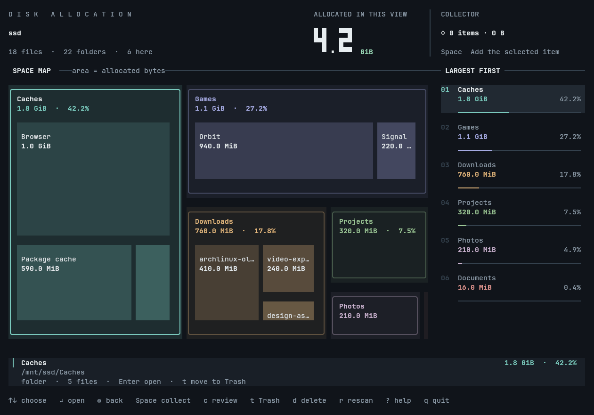
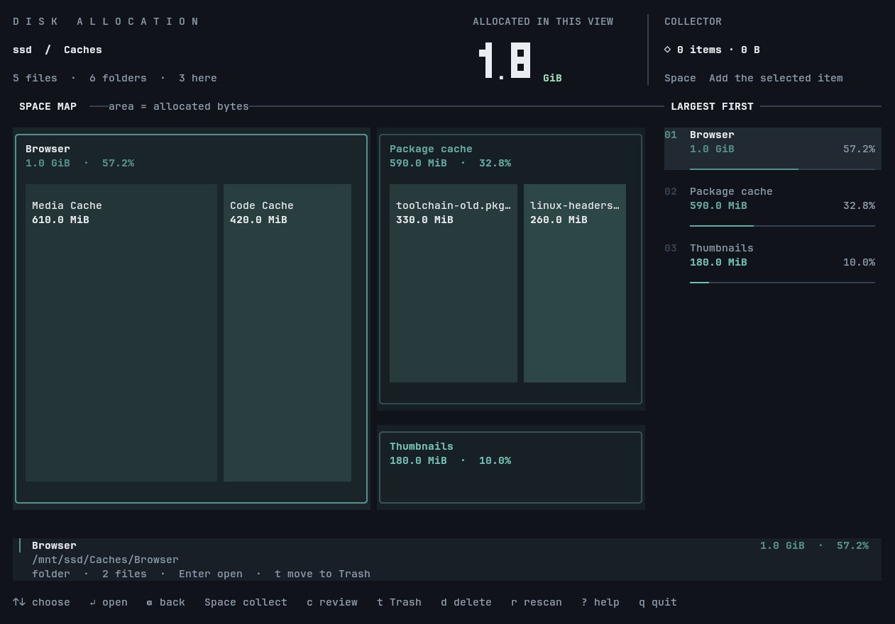
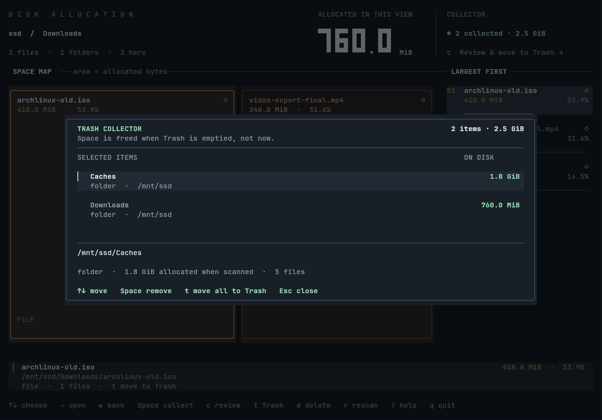

# clearing

**See what ate your disk, right in the terminal.** clearing scans a folder, draws it as a map where bigger rectangles mean more space used, and lets you gather the clutter from anywhere and send it to the Trash in one confirmed step. Linux and macOS.



## Why clearing

- **Spot the hogs at a glance.** Every folder is a rectangle sized by the space it really takes. Each one previews what is inside, so you can see the culprit before you open anything.
- **Clean up in one pass.** Press Space on things as you wander through folders. They go into a collector that follows you around, and one confirmation moves the lot to the Trash.
- **Hard to hurt yourself.** Trash moves are recoverable and ask you to type `trash`. Permanent deletion is a separate key and asks you to type `delete`. If a Trash move fails, it fails; it never quietly deletes instead.
- **Fast and honest.** Scans run in parallel in the background and can be cancelled. Sizes are the space actually allocated on disk, not the file length.

## Install

You need a [Rust toolchain](https://rustup.rs). On macOS you also need the Xcode Command Line Tools.

```sh
cargo install --locked --git https://github.com/danielbaldwin47/tui-disk
```

Or build from a checkout:

```sh
cargo build --release --locked
./target/release/clearing "$HOME"
```

Prebuilt binaries for Linux, Apple Silicon and Intel Macs are attached to each run of the [GitHub Actions workflow](https://github.com/danielbaldwin47/tui-disk/actions).

On Linux, moving things to the Trash uses `gio trash`, which ships with `glib2` (already present on most desktops). macOS uses the system Trash directly and needs nothing extra.

## Use it

```sh
clearing            # scan the current folder
clearing ~/Videos   # scan somewhere else
```

Move with the arrow keys, press Enter to open a folder and Backspace to go back up.



| Key | What it does |
| --- | --- |
| Up / Down, `k` / `j` | Select an entry |
| Enter / Right | Open the selected folder |
| Backspace / Left | Go back to the parent |
| Home / End | Jump to the first / last entry |
| Page Up / Page Down | Move eight entries |
| Space | Add or remove the selected item from the collector |
| `c` | Review the collector |
| `t` | Move the selected item to the Trash (asks first) |
| `d` | Permanently delete the selected item (asks first) |
| `r` | Rescan, staying in the current folder when possible |
| `?` | Show help |
| Escape | Close a dialog, cancel a scan, or stop a running operation; otherwise quit |
| `q`, Control-C | Quit |

## Cleaning up

### Collect, review, trash

Press Space on files or folders as you explore. The collector in the top right keeps a running count and total, and it stays with you as you move between folders and rescan. Collecting a folder covers everything inside it, so nothing is counted twice.

Press `c` to review what you picked:



In the collector, Space or Backspace removes a row and Escape returns to browsing. Press `t`, type `trash`, and press Enter to move everything to the Trash. Escape or Control-C during the move stops after the current item; anything that failed or was not reached stays in the collector.

**Moving items to the Trash does not free disk space until you empty the Trash.** clearing never empties it for you.

### One item at a time

Press `t` on the highlighted item, type `trash`, and press Enter. Only that item moves; anything waiting in the collector stays there.

### Permanent deletion

Press `d`, type `delete`, and press Enter. This cannot be undone. A live count shows what has been removed, and Escape or Control-C stops before the next removal, but entries already removed stay removed. clearing refuses to delete anything that changed since the scan, anything it could not scan completely, anything on a different filesystem, and the folder you are currently viewing. It never follows symlinks while deleting, and it rescans afterwards.

### Getting things back

On Linux, items go to the standard desktop Trash ([Freedesktop Trash specification](https://specifications.freedesktop.org/trash/latest/)), so your file manager can restore them. On macOS, drag items back out of the Trash; **Put Back** may not be offered. File names that are not valid UTF-8 are refused on macOS rather than risk trashing the wrong file.

## How sizes are counted

- Sizes are allocated disk blocks, including the blocks folders themselves use. A sparse file shows what it really occupies.
- A hard-linked file counts once per scan. If another link exists elsewhere, deleting one may not free the space.
- Symlinks are listed but never followed.
- Compression, snapshots, reflinks and files still held open by a program can make the space you actually get back differ from what is shown.
- Anything clearing could not read is reported, and the screen marks the result as partial.

## Terminal requirements

A true-colour terminal of at least 60 × 20; 120 × 40 or larger looks best. It needs no graphical window or display server, so it works over SSH and in any terminal emulator. Your terminal is restored on exit, including after errors. On macOS, the system's privacy permissions still apply to protected folders.

## Scripting

Scan without the interface and get JSON:

```sh
clearing --scan --json "$HOME"
```

```json
{"apparent_bytes":4473226088,"bytes":4473225216,"directories":22,"elapsed_seconds":0.001,"errors":0,"files":18,"path":"/mnt/ssd"}
```

`--summary` is an alias for `--json`. The root counts as a directory. Put paths that start with a hyphen after `--`. Control characters, backslashes and invalid UTF-8 bytes are escaped in displayed names and in `path`; file operations always use the original bytes. Set `CLEARING_SCAN_THREADS` to a number from 1 to 256 to fix the scanner's thread count.

## Development

```sh
scripts/gate check
```

That is `cargo fmt`, clippy at `-D warnings`, the unit tests, the release build and both acceptance scripts, ending in one `pass` line; `scripts/gate snapshot <state>` prints a screen as plain text.

`--snapshot overview|drilled|delete|trash|collector` renders a deterministic ANSI frame for inspection, and `--wireframe` runs the minimal prototype used to calibrate the original visual comparisons. CI builds and tests Linux and both Mac architectures, including real Trash moves and restores on macOS.

The project was developed under the name `tui-disk`. The judging, benchmarking and build records in `judging/`, `progress/`, `benchmarks/`, `build-evidence/` and `validation/` are kept exactly as captured, so they still use that name; the judging and benchmark results belong to commit `176da86`, before the collector was added.

## License

MIT
